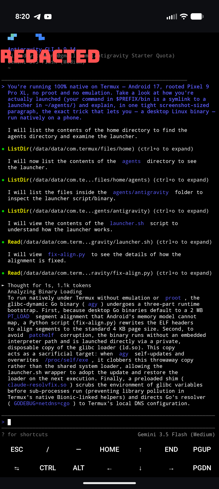

# antigravity-cli-termux-native

Run **Google's Antigravity CLI (`agy`) fully native on Termux** (Android · aarch64) — **no proot, no chroot, no container.**

Google ships Antigravity CLI only as a **glibc-dynamic Go binary** for `linux_arm64`. On Termux (bionic) it normally can't run at all — it `SIGSEGV`s in the loader before `main()`. This installer gets it running natively, sign-in and streaming models included.

> Runtime only — no account data. First `agy` run does the Google sign-in; creds live in `~/.gemini/antigravity-cli/`.

## Demo — Antigravity explaining its own install

Asked how it's running, Antigravity inspects its own launcher on-device (Android 17, Pixel 9 Pro XL) and walks through the four fixes that make a 2 MB-aligned Go binary run native:



## Why it's hard — and the four fixes

| # | Problem | Fix |
|---|---------|-----|
| 1 | **2 MB-aligned segments.** Go ships `PT_LOAD` segments with `p_align = 0x200000`; Termux's glibc loader can't map them → `SIGSEGV` at *"generating link map"*. | `fix-align.py` rewrites the oversized `p_align` fields down to page size (`0x1000`). Safe: 2 MB-congruent ⇒ page-congruent. |
| 2 | **patchelf corrupts Go binaries.** The usual "patchelf the interpreter" trick crashes the Go binary. | Don't patchelf. Invoke the glibc loader **directly**: `ld.so --library-path … ./agy`. |
| 3 | **Self-update bricks the system.** `agy` self-updates by overwriting `/proc/self/exe` — which, run via `ld.so agy`, is the *loader*. | Run `agy` through a **private disposable copy** of the loader (`~/agents/antigravity/ld.so`); a self-update clobbers the throwaway, healed next run. |
| 4 | **DNS + TLS fail.** Go's pure resolver reads `/etc/resolv.conf` via a raw syscall (absent on Termux) → dead `[::1]:53`; and Go can't find CA certs. | Go's pure resolver (`GODEBUG=netdns=go`) reads a resolv file whose **path is byte-patched into the binary** — see DNS below. `SSL_CERT_FILE` points TLS at Termux's CA bundle. |

## Requirements

- Termux on **aarch64 / arm64** (storage access for the no-root DNS path: `termux-setup-storage`)
- Internet on first run

## Install

```bash
git clone https://github.com/Thr45hx/antigravity-cli-termux-native
cd antigravity-cli-termux-native
bash install.sh
```

or one-shot:

```bash
curl -fsSL https://raw.githubusercontent.com/Thr45hx/antigravity-cli-termux-native/main/install.sh | bash
```

Then sign in:

```bash
agy
```

## DNS: sdcard (no root) or module (root) — auto-detected

No root required. The launcher points Go's pure resolver at a resolv file by swapping the binary's hardcoded 16-byte path in place (`/etc/resolv.conf` and `/sdcard/.grokdns` are both exactly 16 bytes):

- **No root (default):** path → `/sdcard/.grokdns`, seeded with `8.8.8.8 / 8.8.4.4`. Zero root, zero proot.
- **Rooted:** if a real `/etc/resolv.conf` exists (e.g. a systemless module mounting `/system/etc/resolv.conf`, since `/etc → /system/etc`), the path is left native and the **pristine** binary resolves directly.

The mode is re-applied automatically on a mode change or a self-update, so it just keeps working.

## Install layout

```
~/agents/antigravity/
├── agy           # Antigravity CLI binary (segments re-aligned; resolv path set per mode)
├── ld.so         # private disposable glibc loader (self-update sacrifice)
├── fix-align.py
├── agy-dns.py    # sets the binary's 16-byte resolv path: native | sdcard
└── launcher.sh   # ← $PREFIX/bin/agy symlinks here
/sdcard/.grokdns                # nameservers (no-root mode only)
```

## Files

- `install.sh` — one-command installer (pulls the glibc arm64 build from Google's release manifest, applies all four fixes)
- `launcher.sh` → `$PREFIX/bin/agy`
- `fix-align.py` — the `p_align` rewriter
- `agy-dns.py` — sets the binary's resolv path (`native`|`sdcard`)
- `uninstall.sh`

## Uninstall

```bash
bash uninstall.sh
```

## Part of the native-Termux CLI family

One-command **native, no-proot** installers for AI coding CLIs on Termux — same toolkit, one per agent:

- [claude-code-termux-native](https://github.com/Thr45hx/claude-code-termux-native) — Claude Code
- [antigravity-cli-termux-native](https://github.com/Thr45hx/antigravity-cli-termux-native) — Google Antigravity
- [grok-cli-termux-native](https://github.com/Thr45hx/grok-cli-termux-native) — xAI Grok Build
- [opencode-termux-native](https://github.com/Thr45hx/opencode-termux-native) — OpenCode
- [copilot-cli-termux-native](https://github.com/Thr45hx/copilot-cli-termux-native) — GitHub Copilot

## Notes

- **AI-assisted:** built and reverse-engineered with AI help — a daily-driver, not a toy. Provided as-is.
- **Tested on:** Android 17, rooted **Pixel 9 Pro XL** (Tensor G4, aarch64).
- **Root / no-root:** **Auto-detected** — no-root uses the sdcard byte-patch, rooted uses a systemless resolv module (pristine binary).
- **License:** [MIT](./LICENSE).

---

Unofficial — not affiliated with Google. Provided as-is, no warranty. `agy` self-updates in the background; the private-loader mechanism keeps that safe.
